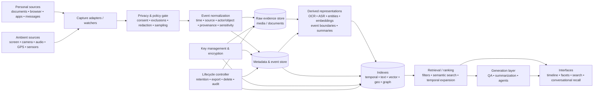

# Lifestreams from 1996 to 2026: Research, Systems, Standards, and the Return of “Total Recall”

## Executive summary

“**Lifestreams**” began in 1996 as a specific computer-science proposal by Eric Freeman and David Gelernter at Yale: replace files, folders, filenames, and much of the desktop metaphor with a **chronologically ordered stream of documents** extending from the past through the present into future reminders. Search produced temporary or persistent substreams; summarization compressed a stream into higher-level documents; chronology itself supplied context and acted as an organizing principle. The original system was therefore more radical than a timeline UI: it was intended as a storage and interaction model for essentially all personal information. citeturn3view0turn3view1turn15search1

Over the following three decades, the exact Yale architecture did not become the dominant operating-system model, but most of its important ideas **fragmented, specialized, and then reconverged**. MyLifeBits explored a database containing effectively “everything” in a person's digital life; Microsoft SenseCam made passive first-person capture practical; social networks transformed chronological streams into externally published social feeds; Activity Streams standardized machine-readable social events; ActivityPub turned such events into a federated protocol; quantified-self systems specialized in structured behavioral telemetry; and recent products such as Rewind/Limitless, Microsoft Recall, ActivityWatch, and screenpipe have returned to the original ambition of making a person's computational history searchable. citeturn8view0turn8view1turn16search3turn18view0turn18view1turn20view0turn20view2

The most important conceptual change is from a **document stream** to a **multimodal event stream**. Modern systems may ingest screenshots, accessibility trees, browser activity, application/window telemetry, audio, transcripts, images, GPS, biometrics, and other sensors. Their primary indexes are no longer only timestamp and text: OCR, automatic speech recognition, visual embeddings, entity extraction, geospatial metadata, and multimodal vector representations make heterogeneous episodes searchable from natural language. Current lifelog retrieval research combines CLIP-like image-text embeddings, LLM query rewriting, temporal-event expansion, multimodal LLM reranking, and interactive interfaces. citeturn22view0turn22view3

The original Lifestreams `find → substream → summarize` abstraction also looks unexpectedly contemporary. In modern terminology it resembles **retrieval → context construction → synthesis**. The major difference is epistemic: a 1996 summary was an explicit computation over stored documents, whereas an LLM-generated “memory” can hallucinate, omit, merge, or reinterpret evidence. A credible modern Lifestream therefore needs a strict separation between **captured evidence**, **derived metadata**, **model inference**, and **generated narrative**.

The field's center of gravity has consequently shifted. Storage capacity is no longer the hardest problem. The difficult questions are now **event segmentation, multimodal retrieval, semantic compression, provenance, selective forgetting, privacy, bystander consent, secure agent access, and long-term interpretability**. Contemporary benchmarks such as NTCIR Lifelog and the ACM Lifelog Search Challenge explicitly study semantic access, known-item retrieval, ad-hoc search, question answering, knowledge discovery, and interactive retrieval over large multimodal lifelogs; LSC'26 added general-research and open-source tracks to improve architectural exploration and reproducibility. citeturn22view1turn22view2turn22view3

Privacy has moved from a peripheral systems issue to a first-class architectural constraint. Activity Streams 2.0 explicitly warns that activity data can reveal identity, location, physical characteristics, and behavioral profiles and recommends limiting sensitive data by default unless users opt in. Microsoft Recall similarly moved toward opt-in collection, local encrypted snapshot storage, encrypted indexes, Windows Hello protection, deletion/pause controls, and application/site filtering. Meanwhile, GDPR, the amended California CCPA, biometric/privacy laws, workplace rules, and jurisdiction-specific recording laws mean that an always-on personal memory can implicate people who never chose to become part of the stream. citeturn18view0turn20view0turn24view1turn24view2

The strongest research direction is therefore not simply “record more.” It is a **local-first, provenance-preserving, consent-aware personal event architecture** that records selectively, derives representations on-device where feasible, separates raw evidence from generated interpretations, supports cryptographic deletion and time-bounded retention, exposes narrowly scoped APIs to agents, and makes every synthesized recollection traceable back to its source evidence.

## Definitions and conceptual scope

The literature uses “lifestream,” “lifelog,” “activity stream,” “personal data stream,” and “lifecasting” loosely enough that treating them as synonyms obscures important differences.

| Concept | Primary unit | Direction and purpose | Relationship to 1996 Lifestreams |
|---|---|---|---|
| **Lifestreams, Yale sense** | Document/object | Personal information storage and interaction ordered by time, including past, present, and future | The original concept: chronological universal store with `new`, `clone`, `transfer`, `find`, `summarize`, dynamic/persistent substreams. citeturn3view1turn5view0 |
| **Social lifestream / lifestreaming** | Published post or external-service activity | Aggregates or publishes “what I am doing” as a reverse-chronological feed | Reuses chronology and aggregation, but changes the objective from personal information management to social communication/publication. Activity Streams emerged partly from this ecosystem. citeturn18view0turn9news48 |
| **Activity stream** | Structured activity/event | Machine-readable description of an action, normally involving an actor, activity type, object and optional context/target | Formalizes the *event semantics* that the Yale stream largely left implicit in documents and metadata. Activity Streams 2.0 is JSON/JSON-LD based. citeturn18view0 |
| **Lifelogging** | Captured episode or sensor observation | Passive or semi-passive recording of a person's experience and context | Extends the stream from documents created intentionally to observations generated continuously by cameras, microphones, devices, or sensors. SenseCam is an archetypal example. citeturn16search2turn16search3 |
| **Personal/quantified-self data stream** | Structured telemetry point or interval | Measurement of behavior, physiology, application use, location, sleep, exercise, etc. | Replaces heterogeneous documents with high-volume time series and events; ActivityWatch is an open-source computational-activity example. citeturn17search2turn20view2 |
| **Modern AI memory / replay system** | Screenshot, audio segment, transcript, accessibility snapshot, semantic event | Makes prior experience searchable or usable as context for assistants/agents | Recreates the universal-memory ambition with OCR/ASR/embeddings/LLMs rather than primarily directory/query machinery. Microsoft Recall, Rewind/Limitless and screenpipe represent this branch. citeturn20view0turn20view1turn21search26 |

### The original definition was stronger than “timeline”

Freeman and Gelernter defined a lifestream as a **time-ordered stream of documents functioning as a diary of electronic life**. Its past begins effectively at one's “electronic birth”; the stream approaches the present as documents become more recent, while its future contains reminders, calendar items, and to-dos. Rather than putting a document into a named directory, a user creates it in the stream and obtains views by searching. citeturn3view1

The especially important construct was the **substream**. `Find` produced a query-defined stream; persistent substreams could automatically admit new matching documents, making them closer to dynamic database views or standing queries than conventional folders. `Summarize` could transform a stream into overview documents at different levels of abstraction. citeturn3view1turn3view2

Three principles follow from this:

**Chronology is identity-adjacent metadata.** Location in time supplies context independently of a human-created filename or directory path. This is now routine in photo libraries, messaging histories, event logs, observability systems, and lifelogs, but was central to Lifestreams' argument against hierarchical filing. citeturn3view1turn5view0

**Collections should be computed rather than filed manually.** A persistent substream is a precursor in spirit to saved searches, smart folders, continuous queries, filtered feeds, and materialized views.

**Summarization belongs inside the information system.** Lifestreams treated overview generation as a core operation rather than merely a presentation feature. That idea becomes much more powerful—and much more dangerous—when the summarizer is a generative model.

### “Social stream” and “personal memory” solve opposite information-flow problems

A useful distinction is **inward capture versus outward publication**. Lifelogging and personal-memory systems primarily collect information *about or for the user*. Social streams primarily select and distribute information *from users to other people*. Activity Streams sits between the two: its abstract data model can describe an activity log whether the ultimate purpose is federation, audit, recommendation, or personal history. W3C defines an Activity as a machine-processable semantic description of an action and provides Objects, Actors, Activities, Links and Collections as its core model. citeturn18view0

This distinction matters technically. A social activity protocol is designed for interoperable exchange and audience targeting, while a lifetime personal store must additionally solve high-volume capture, private indexing, deletion, long-term preservation, encryption, sensor synchronization and retrieval over data never intended for publication.

## Chronology, milestones, people, patents, and standards

The history is better understood as several intersecting lineages rather than one continuous Lifestreams project.

### Chronological development

| Period | Milestone | Why it matters |
|---|---|---|
| **1996** | Freeman and Gelernter publish **“Lifestreams: A Storage Model for Personal Data”**, Yale report YALEU/DCS/RR-1096 / SIGMOD-era work. | Establishes the chronological document stream, dynamic substreams, persistent filtering, future documents and summarization as a replacement for directory-oriented personal storage. citeturn3view0turn3view1turn0search13 |
| **1996** | Yale files the patent underlying **US 6,006,227, “Document stream operating system.”** | Converts the research architecture into broad claims around chronologically ordered documents, dynamically created streams, search, summarization and networked/client-server access. citeturn5view0 |
| **1999** | US 6,006,227 is granted. | The patent family becomes commercially and later legally important; Google Patents now lists the foundational patent as expired. citeturn5view0 |
| **2001** | Mirror Worlds commercializes related ideas in **Scopeware**; Microsoft Research's **MyLifeBits** experiment begins around the same period. | The lineage splits into enterprise chronological information management on one side and “lifetime store” research on the other. Scopeware integrated files, email and scanned records into a chronological interface; MyLifeBits pursued a unified personal database. citeturn15news42turn8view0 |
| **2002** | Bell and Gemmell publish **“MyLifeBits: Fulfilling the Memex Vision.”** | Moves from chronology alone toward comprehensive multimedia capture and database-backed personal memory. citeturn6search7 |
| **2004** | Microsoft Research establishes **SenseCam**; MyLifeBits work turns explicitly toward passive capture. | Introduces continuous, wearable, first-person imagery and environmental sensing into the personal-memory problem. Microsoft dates the SenseCam project to February 25, 2004. citeturn16search9turn6search7 |
| **2006** | The CACM article **“MyLifeBits: a personal database for everything”** and UbiComp paper **“SenseCam: A Retrospective Memory Aid”** appear. | By then MyLifeBits incorporated documents, communications, web activity and thousands of SenseCam photographs; SenseCam demonstrated sensor-augmented passive capture and clinical memory-aid potential. citeturn8view0turn16search0turn16search2 |
| **2009–2011** | Social-web companies and the Activity Streams community converge around a common activity representation; **JSON Activity Streams 1.0** is finalized in 2011. | “Stream” shifts from personal OS architecture to a portable representation of social events; AS1 established the influential actor/verb/object-style model. citeturn9news48turn18view0turn18view2 |
| **2016** | NTCIR-12 introduces the first comparative **Lifelog** evaluation/test collection; ActivityWatch is already developing early clients. | Lifelogging matures from individual prototypes into reproducible information-retrieval research, while open-source local behavioral tracking emerges. citeturn12search0turn12search24turn17search14 |
| **2017** | **Activity Streams 2.0** becomes a W3C Recommendation; ActivityWatch reaches broader beta development. | AS2 moves the activity model to extensible JSON-LD-style semantics, collections and explicit audience/privacy considerations. citeturn18view0turn17search22 |
| **2018** | **ActivityPub** becomes a W3C Recommendation; the ACM **Lifelog Search Challenge** begins its annual series. | One stream lineage becomes decentralized social infrastructure; another becomes a mature multimedia-retrieval benchmark ecosystem. citeturn9search20turn11search14 |
| **2022** | **Rewind** appears on macOS, continuously recording screen/audio history for search. | Consumer “computer memory” returns almost directly to the universal-personal-history objective, now using OCR, speech transcription and local storage. citeturn21news39 |
| **2024–2025** | Microsoft introduces **Recall**; Rewind evolves into **Limitless** and wearable conversational capture; screenpipe develops as an open alternative; multimodal LLM retrieval enters lifelog benchmarks. | The field converges on AI-indexed episodic memory: screenshots, accessibility data, audio, transcripts, vectors and natural-language retrieval. citeturn20view0turn20view1turn21search26turn22view0 |
| **2025** | NTCIR-18 **Lifelog-6** systems use CLIP, LLM rewriting, temporal expansion and multimodal LLM reranking. Meta acquires Limitless in December. | Modern retrieval moves beyond keyword/tag matching into multimodal semantic reasoning; commercial consolidation reaches AI-memory wearables. citeturn22view0turn20view1 |
| **2026** | The ninth **Lifelog Search Challenge** adds General Research and Open Source tracks; NTCIR-19 announces **Lifelog-7** covering semantic access, personal knowledge mining and question answering. | The frontier is increasingly about reusable architectures, reproducibility, knowledge extraction and conversational access rather than capture alone. citeturn22view1turn22view2 |

### Researchers, laboratories, and institutions

**Eric Freeman and David Gelernter at Yale** are the primary originators of Lifestreams proper. Yale's project page still explicitly describes the work as a “network-centric replacement for the desktop metaphor,” which is important: the original claim concerned system organization, not just a visual history. citeturn15search1

**Gordon Bell and Jim Gemmell at Microsoft Research** drove MyLifeBits and the “lifetime store” line. Their work asked what happens when essentially every document, photograph, communication and eventually sensor observation can be retained and queried. MyLifeBits' published architecture used a unified database, metadata, links and capture/import tools across a very broad set of personal media. citeturn6search0turn8view0turn8view1

**Steve Hodges, Lyndsay Williams, Ken Wood and colleagues at Microsoft Research Cambridge**, together with clinical collaborators, developed the SenseCam lineage. SenseCam was designed to passively record a wearer's day through images plus sensor logs and became influential both in ubiquitous computing and memory-support research. citeturn16search2turn16search9

The contemporary lifelog retrieval community is notably international. **Cathal Gurrin and collaborators at Dublin City University**, along with researchers including Duc-Tien Dang-Nguyen, Björn Þór Jónsson, Wolfgang Hürst, Luca Rossetto, Klaus Schoeffmann, Minh-Triet Tran, Werner Bailer, Steve Hodges and others, have built the Lifelog Search Challenge into a recurring comparative benchmark. The 2026 organizers span DCU, Joanneum Research, Bergen, Utrecht, Klagenfurt, Hokkaido University of Science and other institutions. citeturn22view1

On the social-protocol branch, **James Snell, Martin Atkins, Will Norris, Chris Messina, Monica Wilkinson, Rob Dolin** and a large community contributed to Activity Streams 1.0 and its successor; Activity Streams 2.0 was then produced through the W3C Social Web Working Group. citeturn18view0

### Patents

The historically central patent is **US 6,006,227, “Document stream operating system.”** Filed June 28, 1996 and granted December 21, 1999, it names Freeman and Gelernter as inventors and describes an operating-system/information-management architecture in which documents occupy chronological streams; queries generate substreams; summaries compress related information; and the architecture can operate over networks and heterogeneous document types. Its examples include text, audio, video and multimedia, making its scope conceptually broader than a file-history viewer. Google Patents lists the patent as “Expired – Lifetime,” with the expected term ending in 2016. citeturn5view0

The patent generated a family of continuation-related intellectual property that later formed the **Mirror Worlds** portfolio. Network-1, which subsequently managed that portfolio, describes it as covering unified search and indexing, display and archiving technologies derived from Gelernter and Freeman's mid-1990s work. citeturn15search37

The historical legal significance should not be confused with a technical claim that every later timeline or search product is “Lifestreams.” Patent infringement depends on claim construction and implementation details, while the underlying ideas also interact with prior art and later independent development. For research purposes, the more useful point is that the patent documentation preserves a unusually explicit system description: **chronology, dynamic query-defined streams, transparent storage, future events and summarization were intended to operate together as an information architecture**. citeturn5view0

### Standards

Three standards generations matter most:

| Standard | Date | Model and significance |
|---|---:|---|
| **Activity Streams 1.0** | 2011 | Community-driven JSON and Atom formats for expressing social activities. AS2's own specification identifies May 2011 as the publication point for JSON Activity Streams 1.0. citeturn18view0turn18view2 |
| **Activity Streams 2.0** | 2017 | W3C JSON-based syntax compatible with JSON-LD concepts. Core abstractions include Object, Link, Actor, Activity and Collection; it adds multilingual representation, normalized `type`, audience targeting, consistent paging/collections and extensibility. citeturn18view0 |
| **ActivityPub** | 2018 | W3C decentralized social-networking protocol built on ActivityStreams 2.0, providing client-to-server and federated server-to-server communication. citeturn9search20turn18view1 |

Activity Streams 2.0 is especially relevant to modern Lifestream design because it shows how a “stream” can become an interoperable **event vocabulary** rather than merely a presentation order. It uses `application/activity+json`, supports JSON-LD contexts and extensions, and explicitly incorporates audience targeting. citeturn18view0

Yet AS2 is not a complete personal-lifelog standard. It lacks first-class concepts for high-rate sensor observations, raw media segmentation, confidence distributions, biometric sensitivity, retention policies, cryptographic provenance, consent from multiple observed people, model-generated annotations and distinctions between original evidence versus inferred/generated memory. Those omissions define a substantial standards opportunity.

## Architectures, data models, and implementations

### Evolution of the architecture

The technical evolution can be summarized as five architectural generations.

**Chronological object store — Lifestreams.** The invariant was time. Instead of pathname-centric identity, documents occupied a temporal stream and were selected into query-created substreams. Search and summarization were first-class operations. The design was explicitly network-centric and could carry heterogeneous multimedia objects. citeturn3view1turn5view0

**Relational lifetime store — MyLifeBits.** MyLifeBits began in 2001 using SQL for personal information and evolved toward one database spanning scanned and born-digital documents, photographs, presentations, email-like communications, telephone calls, web activity, recorded conversations and SenseCam imagery. Its architecture placed metadata and relationships around a unified store instead of leaving each medium in an isolated application silo. citeturn8view0turn8view1

**Sensor-augmented event store — SenseCam and quantified self.** SenseCam passively captured images while also recording sensor data, making “what happened” something inferred from synchronized observations rather than a sequence of intentionally created documents. citeturn16search2turn16search3

**Structured distributed activity graph — Activity Streams/ActivityPub.** Here the basic item is not a file or sensor sample but a semantically typed action involving actors and objects. AS2 provides standardized JSON/JSON-LD-compatible serialization and extensibility; ActivityPub supplies transport/federation semantics. citeturn18view0turn18view1

**Multimodal semantic memory — 2020s systems.** Raw history is transformed into searchable representations through OCR, ASR, visual-language embeddings and increasingly LLM/MLLM inference. Microsoft Recall indexes encrypted local snapshots for text/image retrieval; screenpipe combines operating-system accessibility information with screenshots, uses OCR as fallback, captures/transcribes audio and indexes data locally; current lifelog research similarly uses CLIP-family embeddings and multimodal reranking. citeturn20view0turn21search26turn22view0

A modern synthesis looks roughly like this:

This is a synthesis rather than the architecture of any one product. Its lineage is visible in Lifestreams' temporal organization and computed substreams, MyLifeBits' unified multimedia database, Activity Streams' event semantics, modern local lifeloggers, and current multimodal retrieval research. citeturn3view1turn8view1turn18view0turn20view2turn22view0

### Data models and indexing

A robust contemporary model needs at least four logically distinct layers.

**Raw evidence** should preserve the original screenshot, audio chunk, photograph, document or sensor reading without silently mixing it with model output.

**Event metadata** should carry timestamps and intervals, source device/application, provenance, location where appropriate, relationships to neighboring events, and privacy/retention state. Activity Streams demonstrates the value of a common typed event vocabulary, although its social ontology is not rich enough by itself for high-rate lifelog data. citeturn18view0

**Derived representations** include OCR text, ASR transcripts, detected objects/scenes, identities where permitted, embeddings, inferred activities, event clusters and machine summaries. MyLifeBits already anticipated the need for automatic speech/speaker/image/video recognition; twenty years later these are standard components of competitive lifelog retrieval. citeturn8view2turn22view0

**Indexes** increasingly need to be polyglot: timestamp/interval indexes for chronology; inverted indexes for exact text; geospatial indexes; vector indexes for semantic similarity; and graph-like relationships for entities, people, projects and causal/contextual associations. This is one reason a modern Lifestream is better modeled as an **event graph with a privileged temporal axis** than as one physical append-only list.

### Representative implementations

| System / platform | Launch | Core features | Principal data types | Privacy/control model | Status in 2026 |
|---|---:|---|---|---|---|
| **Yale Lifestreams** | 1996 | Chronological universal stream; search-created substreams; persistent filters; summaries; future reminders | Documents and heterogeneous multimedia objects | Privacy was not the central abstraction in the published storage model | Historical research system; concept and papers remain influential. citeturn3view0turn3view1turn15search1 |
| **Scopeware / Mirror Worlds** | 2001 | Commercial chronological “narrative” integrating enterprise files, email and scanned records | Enterprise documents, mail, scans | Enterprise information-management deployment; privacy was not the defining published innovation | Mirror Worlds Technologies ceased operations in 2004; product is historical. citeturn15news42turn25search39 |
| **MyLifeBits** | 2001 | SQL-backed personal lifetime store, metadata, links, search, multimedia ingestion, passive capture | Documents, mail, photos, presentations, calls, web data, audio/video, SenseCam imagery | Primarily a research personal store; later work explicitly surfaced preservation and recognition challenges | Historical Microsoft Research program rather than current end-user product. citeturn8view0turn8view1turn8view2 |
| **Microsoft SenseCam** | 2004 | Passive wearable camera; sensor-triggered capture; retrospective browsing/memory support | First-person still images plus sensor logs | Wearer-operated research device; early work predates today's mature bystander/privacy controls | Research legacy; Microsoft retains the project and publication archive. citeturn16search3turn16search9 |
| **ActivityWatch** | 2016-era early development | Automated app/window/activity tracking; browser/editor watchers; local server; visualization; extensible APIs | Application/window intervals, web activity and extensible quantified-self events | Open source; explicit user data ownership; decentralized sync remains a design goal | Active open-source project; repositories were actively updated in September 2026. citeturn17search14turn20view2turn20view3 |
| **Rewind → Limitless** | 2022 | Searchable screen/audio memory, OCR/transcription; later conversational wearable and summaries | Computer screen/audio; later real-world conversation audio/transcripts | Rewind emphasized local recording and app/private-browsing exclusions; later service terms changed following acquisition | Limitless was acquired by Meta in Dec. 2025; new device sales stopped while existing users continued to be supported. citeturn21news39turn20view1 |
| **Microsoft Recall** | 2024 announcement / 2025 rollout era | Periodic screen snapshots; timeline; text/image semantic search; jump back to source context | Screenshots plus derived contextual/search information | Explicit opt-in, local encrypted storage, encrypted search index, Windows Hello, deletion/pause, application and website filters, private-browser filtering | Active Windows 11 feature for qualifying Copilot+ PCs. citeturn20view0 |
| **screenpipe** | 2024-era open source | Continuous screen/audio capture; accessibility-tree events, OCR fallback, local transcription/diarization, agent-facing API | Screenshots/accessibility data, audio, transcripts, video, metadata | Local SQLite/media storage; local models available; authenticated API; cloud models optional in some workflows | Active project in 2026 and participating in YC S26. citeturn21search2turn21search26 |

The comparison shows a striking architectural loop. Lifestreams and MyLifeBits began with **central personal ownership of the history**. The social-media era shifted streams outward into cloud services and public/shared activities. The newest generation is moving part of the computation back inward—local databases, on-device accelerators, encrypted indexes and user-controlled capture—because AI makes the contents of the stream dramatically more inferentially sensitive. citeturn20view0turn20view2turn21search26

## Research methods and technical evolution

### Capture and sensor fusion

Early Lifestreams assumed that documents already existed. MyLifeBits broadened the acquisition surface to scanners, email, phone calls, instant messaging, web pages, television/radio and other sources. SenseCam then crossed a conceptual boundary by making **passive experience capture** a primary data source: the system records without the user explicitly deciding to create each item. citeturn8view0turn8view1turn16search3

This created the modern **event-segmentation problem**. A camera generating hundreds or thousands of frames does not naturally contain “breakfast,” “meeting,” “train ride” or “conversation with Alice” records. Systems must infer event boundaries from temporal proximity, visual change, location, motion, audio, application transitions and semantic coherence.

That is why sensor fusion is more fundamental than merely combining search results. The system is trying to infer the *latent episode* that generated multiple observations.

### Search: exact metadata to semantic retrieval

The original Lifestreams `find` operation was predicate-like: it selected matching documents and constructed a substream. MyLifeBits added increasingly rich metadata, annotations and full-database querying. citeturn3view1turn8view1

Current lifelog retrieval has shifted toward learned cross-modal spaces. A 2025–2026 review of ACM LSC systems identifies broad adoption of **CLIP/BLIP-style embeddings**, LLMs for conversational retrieval and increasingly multimodal/collaborative interfaces. citeturn22view3

A concrete NTCIR-18 LifeIR pipeline illustrates the contemporary architecture:

`query → LLM rewrite → CLIP candidate retrieval → temporal/event expansion → MLLM reranking/filtering`.

The system operated over more than 725,000 first-person images spanning 18 months, along with time, physical-activity, biometric, location and visual-concept metadata. It evaluated 26 topics with measures including mAP, precision, recall and nDCG. Adding Qwen2-VL-based multimodal filtering improved that team's reported mAP@100 over its CLIP/query-rewrite baseline, illustrating why modern systems increasingly use expensive models only after a cheaper retrieval stage has reduced the candidate space. citeturn22view0

Architecturally, this is very close to a contemporary interpretation of Lifestreams:

> **find a substream → enlarge/contextualize it using temporal structure → summarize or answer over it.**

The difference is that “find” has changed from symbolic matching to heterogeneous learned retrieval.

### NLP, vision, and multimodal models

Modern systems commonly require three machine-perception stages.

**Perception** converts raw signal into representations: OCR for screens/images, ASR for speech, speaker diarization, image/video recognition and sensor-derived features. MyLifeBits already identified automatic speaker, speech, sound, photograph and video recognition as future requirements; that prediction is now essentially the ingestion pipeline of an AI memory system. citeturn8view2

**Alignment** maps modalities into comparable semantic spaces. CLIP-style contrastive image/text embeddings are particularly effective because a natural-language memory cue can retrieve images for which no matching text was ever captured. NTCIR-18 teams use precisely this mechanism. citeturn22view0

**Reasoning and synthesis** employ LLMs/MLLMs to rewrite ambiguous queries, answer questions, rerank candidates and summarize events. LSC's recent review reports increased LLM integration and identifies the combination of embedding retrieval plus LLM interaction as a leading direction. citeturn22view3

The main research warning is that the third stage is not equivalent to memory retrieval. A generated answer is an **interpretation of retrieved evidence**, not evidence itself.

### Summarization and memory compression

“Summarize” was one of Lifestreams' original primitive operations. In the 1996 architecture, summarizers—or “squishers”—could produce condensed representations of a stream, for example over calls or financial records. citeturn3view2turn5view0

Modern systems can implement this recursively:

`raw observations → events → daily summaries → project/person/topic summaries → long-term semantic memory`.

This is attractive because a multi-decade stream will become too large even for inexpensive semantic search. But recursive generative compression introduces **semantic drift**: an incorrect summary can become the input to a later summary, progressively divorcing high-level memory from its evidence.

A preferable architecture treats summaries as **revocable derived views** with explicit provenance. The canonical history remains evidence plus metadata; each claim in a generated summary should be resolvable to source events.

### Visualization and human interaction

Chronological navigation remains valuable because people often recall approximate context—“after lunch,” “before that meeting,” “when I was in Berlin”—more readily than exact keywords. Lifestreams built chronology into the primary UI; Recall exposes an explorable timeline; lifelog retrieval competitions continue to find that interface design can materially affect retrieval performance. citeturn3view1turn20view0turn22view3

The strongest current interfaces therefore combine:

**time + facets + semantic query + spatial/contextual cues + direct evidence preview + conversational refinement**.

Pure chat is unlikely to be enough. It hides uncertainty and makes it difficult to inspect neighboring events, while a pure timeline scales poorly to years of dense capture.

### Benchmarks and evaluation

The NTCIR Lifelog series and ACM LSC represent an important maturation of the field from individual “quantified self” demonstrations to **comparative retrieval science**. NTCIR-19's Lifelog-7 explicitly targets semantic access, personal knowledge discovery and question answering over heterogeneous images, sensors and contextual data. citeturn22view2

LSC, meanwhile, evaluates interactive systems rather than only offline rankings. By 2026 it had reached its ninth annual edition, with a real-time Challenge Track plus General Research and Open Source tracks. citeturn22view1

This distinction is important. For personal memory, ranking metrics such as mAP or nDCG are necessary but insufficient. A realistic system should also measure:

- **time-to-memory** and number of interactions before a correct episode is found;
- **false-memory rate**, where a system confidently returns or synthesizes an event that did not occur;
- **evidence coverage** and citation accuracy in generated summaries;
- **privacy leakage per retrieval task**;
- **cross-modal robustness** when one sensor or metadata source is missing;
- **longitudinal stability**, including whether today's query still retrieves the same evidence after models and embeddings are upgraded.

Those are natural next-generation complements to existing IR evaluation.

## Privacy, ethics, and law

### The fundamental asymmetry: the owner of the stream is not the only data subject

A conventional private diary is mostly written by its owner. A modern lifelog can contain **everyone the owner sees, hears, messages, meets or works with**.

That creates a structural problem that user consent alone cannot solve. An individual may elect to record their screen, but that screen may display someone else's private message, medical data, authentication token or company secret. A wearable microphone may belong to one user while recording ten other people. A first-person camera can capture faces, children, addresses and screens belonging to bystanders.

Activity Streams 2.0 recognized a related risk even for comparatively intentional social events. Its privacy section explicitly notes that activity data may reveal identity, contact information, location and physical characteristics and can be analyzed to construct behavioral profiles; it recommends limiting the kind and amount of sensitive data by default and requiring opt-in for additional detail. citeturn18view0

Continuous lifelogging amplifies that concern because collection is ambient rather than occasional.

### Legal frameworks

In the European Union, data protection is a fundamental right and the GDPR has applied since **May 25, 2018**. A serious commercial Lifestream architecture handling identifiable people therefore has to consider lawful processing, purpose boundaries, transparency, data-subject rights, security and—in designs involving particularly intrusive systematic monitoring—whether additional impact-assessment obligations arise. citeturn24view1

California's CCPA, as amended by the CPRA, supplies a different but overlapping rights regime. The California Attorney General lists rights to know, delete, opt out of sale/sharing, correct inaccurate information and limit use/disclosure of sensitive personal information. Importantly for lifelogs, California's definition of sensitive information includes categories such as **precise geolocation, message contents, genetic information, certain biometrics and health-related information**. citeturn24view2

AI-specific regulation adds another layer when lifelog data feeds consequential classifiers or decision systems. The EU AI Act establishes a risk-based regulatory framework for AI, although the obligations applicable to a given Lifestream product depend on how the system is deployed rather than on the mere fact that it uses AI. citeturn19search26

Audio recording, workplace monitoring, biometric processing, medical information, children's data and evidentiary disclosure additionally depend heavily on jurisdiction and use case. A global product cannot safely model “permission to record” as one Boolean field.

### Product-level mitigation

Microsoft Recall illustrates the contemporary response to early privacy criticism: Microsoft currently documents that snapshot saving is **opt-in**, screenshots and derived information are encrypted on the local drive, snapshots are not shared with Microsoft or other users by default, and access is gated through Windows Hello. Its search index is encrypted as well. Users can pause or delete history and can filter applications and supported websites; supported browsers also exclude private-browsing activity. citeturn20view0

ActivityWatch adopts a different mitigation strategy: openness and local ownership. Its project explicitly treats “the user does not own the data” and centralized synchronization that exposes everything to a server as problems; the software is open source and designed around user-owned data. citeturn20view2

screenpipe similarly represents the local-first direction, with local SQLite/media indexing and local speech models available even though users may choose cloud models in some configurations. citeturn21search26

These approaches reduce cloud exposure but do **not** eliminate the basic privacy problem. A locally encrypted archive can still contain unlawfully or unethically captured bystander data, and once an AI agent is allowed to query the archive, its effective permission boundary may become much wider than the permissions of the applications from which the information originally came.

### A more appropriate threat model

A modern Lifestream should assume at least five adversarial or failure modes.

**Device compromise.** A lifetime archive is unusually damaging because one breach exposes not a single account but potentially years of interpersonal, professional, financial, health and location context.

**Inference attacks.** Seemingly harmless observations can collectively reveal relationships, routines, religion, health, sexuality, political views or workplace behavior. Activity Streams' warning about profiling applies even more strongly to a dense private lifelog. citeturn18view0

**Agent overreach.** An AI assistant with unrestricted semantic search may retrieve information that the current task did not need, defeating application-level separation.

**Secondary-use drift.** Data collected “for memory” can become attractive for employee evaluation, advertising, insurance, litigation, model training or surveillance.

**Incorrect memory.** AI introduces a novel privacy and reputational risk: systems may not merely expose true sensitive information; they can infer or generate **false sensitive claims** about people.

### Technical mitigation should be layered

The strongest architecture is not simply “encrypt the database.” It combines several mechanisms:

**Capture minimization** — event-triggered capture instead of indiscriminate sampling; application/site exclusion; private-mode detection; microphone/camera indicators; sensitive-window classification.

**On-device transformation** — OCR, ASR, embedding generation, face/secret redaction and event segmentation locally whenever feasible, transmitting only the minimum derived representation required for external processing.

**Compartmentalization** — separate encryption domains for work, health, communication and ambient capture rather than a single key unlocking one's entire biography.

**Purpose-scoped agent APIs** — an agent should obtain a capability such as “search my work meetings from the last week” rather than unconstrained SQL/vector access to the lifetime store.

**Provenance-preserving redaction** — derived indexes must be deleted or regenerated when underlying data is removed; otherwise “deleting the screenshot” while retaining its OCR text, embedding and summary is not meaningful deletion.

**Retention and deliberate forgetting** — raw screen/audio capture should normally have shorter default lifetimes than deliberately preserved events unless the user explicitly promotes an item to long-term memory.

**Auditable inference** — summaries and answers should identify which records they used and whether statements are observed, inferred or generated.

The last distinction is essential. A personal memory system becomes trustworthy only when it can say, in effect: **“I recorded this,” “I inferred this,” or “I am speculating.”**

## Open problems and research agenda

The deepest unresolved issue is that the 1996 vision assumed that **remembering more is beneficial**. Thirty years of ubiquitous sensing and AI suggest the actual design objective should be **remembering the right things, at the right fidelity, for the right duration, under the right authority**.

### Near-term research

For roughly the next one to three years, the most productive work is architectural and measurable rather than speculative.

**A privacy–retrieval benchmark.** Existing LSC/NTCIR work measures retrieval quality extremely well, but next-generation datasets should attach sensitivity/bystander labels and evaluate a **privacy–utility frontier**: how much retrieval performance is retained as progressively stricter redaction, retention and access policies are enforced. This would extend the shared-evaluation culture already established by NTCIR and LSC. citeturn22view1turn22view2

**Evidence-grounded personal RAG.** Every generated recollection should be backed by immutable source-event identifiers. Evaluation should score not merely answer accuracy but whether each factual proposition is supported by the cited screen/audio/image/sensor evidence. This directly addresses the gap between the original deterministic `summarize` operation and probabilistic LLM synthesis. citeturn3view1turn22view0

**Consent-aware event schemas.** A personal event should contain policy metadata at the same architectural level as its timestamp: source, subjects/bystanders, capture basis, sensitivity, sharing scope, retention deadline, allowed computations and deletion propagation state. Activity Streams 2.0 provides a useful extensible event foundation but not this richer lifetime-memory policy model. citeturn18view0

**Better event segmentation.** Research should optimize for meaningful autobiographical episodes rather than arbitrary screenshots or fixed-duration audio windows. Multimodal change-point models can jointly use app transitions, semantic shifts, speech turns, motion, location and user interaction.

**Retrieval under incomplete recollection.** Real queries are often episodic and uncertain—“that diagram I saw around the time Alice mentioned the database bug.” Benchmarks should systematically vary temporal, visual, entity and relational uncertainty instead of assuming well-specified text queries.

**Selective local models.** On-device lightweight models should handle the high-volume stages—redaction, OCR/ASR, embeddings, sensitivity detection—while larger models are invoked only for narrow, user-authorized subsets. Recall's on-device/local design and current local lifeloggers show why this systems problem is now practical rather than hypothetical. citeturn20view0turn21search26

### Mid-term research

Over roughly three to seven years, the challenge becomes **lifetime-scale memory management**.

**Memory consolidation rather than endless accumulation.** A useful system should learn a hierarchy resembling:

`observation → event → episode → project/topic → durable memory`

while maintaining reversible links downward to evidence. Low-value raw observations can expire after consolidation, subject to user policy.

**Semantic forgetting.** Deletion is difficult once one event contributes to OCR indexes, embeddings, entity graphs, daily summaries and personalized models. Research needs dependency-aware erasure: removing an event should invalidate or recompute all downstream representations derived from it.

**Encrypted semantic retrieval.** Local-first storage helps, but users will want synchronization and multi-device search. Practical methods are needed for searchable encrypted/vector data without exposing an entire autobiographical corpus to a synchronization provider.

**Cross-device personal event federation.** Instead of uploading all life data into one company's cloud, a user could own a logical personal stream federated across laptop, phone, wearable, vehicle and home devices. ActivityPub demonstrates that decentralized event exchange is operationally viable for social objects, although a personal-memory protocol would require much stronger confidentiality and policy semantics. citeturn18view1

**Stable representation across model generations.** A 40-year archive cannot depend on one embedding model's vector geometry. Long-lived systems need raw evidence preservation plus versioned, regenerable indexes. MyLifeBits already identified format migration and long-term preservation as lifetime-store problems; AI embeddings add another layer of representational obsolescence. citeturn8view2

**Personalized retrieval without behavioral centralization.** User-specific models should learn what “important,” “meeting,” “family,” or “project X” means without requiring a provider to ingest the underlying stream. Federated or on-device adaptation is an obvious direction, but longitudinal evaluation should test both privacy leakage and catastrophic forgetting.

### Long-term research

Beyond roughly seven years, the questions become partly cognitive and institutional.

**Can a lifetime archive remain epistemically trustworthy?** Generated autobiographical narratives will increasingly influence how people remember their own lives. Systems need provenance, calibrated uncertainty, contradiction detection and mechanisms to preserve disagreement between sources rather than collapsing them into a convenient narrative.

**Whose memory is a shared event?** A dinner, meeting or conversation belongs experientially to several people. Future work needs multi-party models of ownership and consent in which one participant cannot necessarily exercise unlimited computational rights over the other participants merely because their device performed the recording.

**What does a right to forget mean for an AI memory?** Deleting bytes is insufficient if personalized models, summaries or knowledge graphs retain the information. Conversely, perfect deletion may conflict with legal preservation, audit requirements or another participant's legitimate copy. The problem is fundamentally one of information lineage and governance.

**How should agents inherit memory permissions?** A future agent that can plan travel, send messages, negotiate purchases and search twenty years of user history creates an enormous privilege-escalation surface. Personal-memory systems will need capability-based access, query budgets, semantic firewalls and perhaps user-visible “memory access receipts.”

**How much forgetting is cognitively desirable?** Computer science has largely treated perfect recall as an optimization target. Human memory is selective and reconstructive. Long-term studies should compare perfect retention with systems that intentionally decay low-value detail, measuring effects on well-being, decision quality, interpersonal conflict, creativity and dependence on external memory.

**Intergenerational and posthumous archives.** Decades-long Lifestreams eventually outlive devices, providers and their users. Research will need policies for inheritance, expiration, identity rights of other people in the archive, model migration and the distinction between an archival record and an AI simulation of its subject.

### A concrete modern research target

A compelling successor to Freeman and Gelernter's system would not simply implement “Recall, but for everything.” It would define a **Personal Event Stream Protocol** with:

`Event = evidence + temporal context + provenance + semantic representations + policy`

rather than merely:

`Event = timestamp + content`.

Its query layer would recreate the strongest original Lifestreams idea—**dynamically computed substreams**—using hybrid temporal, lexical, vector, graph and geospatial retrieval. Its summarization layer would generate hierarchical memories while preserving source citations. Its synchronization protocol would be local-first and encrypted. Its privacy model would treat subjects and bystanders as policy principals rather than visual features to be recognized. And its API would expose task-scoped capabilities to AI agents rather than universal access to the user's past.

The historical arc is therefore less “Lifestreams failed and was rediscovered” than a gradual decomposition and reconstruction of its vision. **1996 solved the information architecture conceptually: organize personal information around time, compute views instead of filing manually, and make summarization fundamental.** MyLifeBits and SenseCam expanded the capture surface; social activity streams supplied interoperable event semantics; lifelog research supplied datasets and evaluation methodology; and today's multimodal models supply the semantic indexing that early systems lacked. citeturn3view1turn8view0turn16search2turn18view0turn22view3

What remains unsolved is arguably harder than storage or search: building a lifetime memory that is **selective without being lossy, comprehensive without being surveillant, intelligent without inventing memories, interoperable without surrendering control, and durable without preventing people from forgetting**.