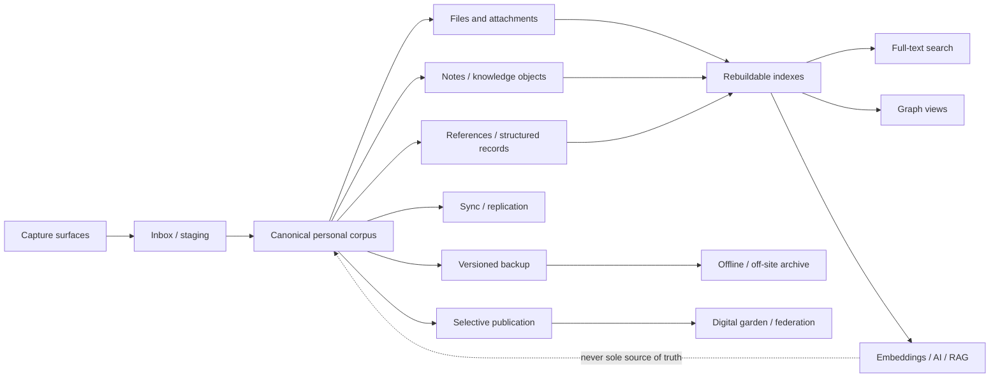
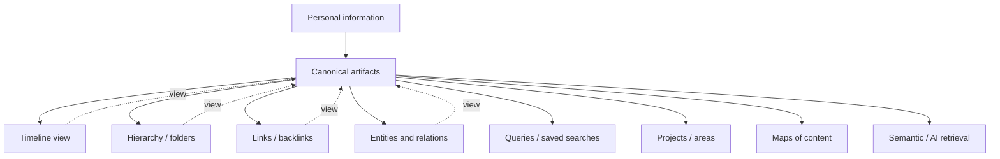
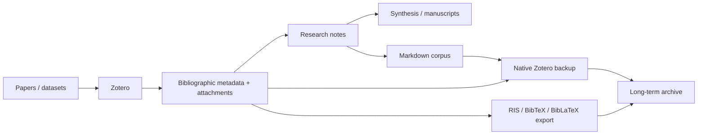
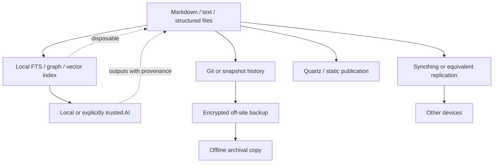

# Personal Information Management Beyond Lifestreams: Modern Architectures, Research, and Lessons Learned

## Executive summary

Personal information management (PIM) is best treated not as a single application or a universal “second brain,” but as a **personal information architecture**: the practices and systems by which an individual captures, organizes, retains, retrieves, uses, shares, and eventually preserves or deletes information. Contemporary research increasingly treats PIM as a fragmented ecosystem spanning files, notes, cloud storage, messaging, mobile devices, calendars, references, and specialized applications rather than as one repository. A 2026 study of 1,011 people found that using many PIM technologies did not predict information overload directly; instead, overload was mediated through keeping and organizing practices and the associated feelings of desperation or efficacy. citeturn20search7turn20search3

The strongest alternative to the classic **lifestream** idea—organizing personal information primarily as a chronological record, often coupled with broad or total capture—is **curated, artifact-centric PIM**. In this model, chronology is useful metadata and one possible view, but the durable objects are documents, notes, references, entities, projects, conversations, and relationships. This conclusion is consistent with the older critique of “total capture” in lifelogging and with newer evidence showing enormous, heterogeneous personal collections and significant costs associated with capture without subsequent contextualization and curation. citeturn1search17turn19search1turn19search9turn20search2

The most robust modern architecture is therefore not “put everything into app X.” It is:

**open or well-exportable canonical data → local or user-controlled working copies → optional encrypted synchronization → replaceable indexes and AI layers → independent versioned backups → preservation copies.**

The local-first literature articulates much of this model explicitly: local availability, offline operation, multi-device collaboration, privacy, longevity, and user ownership should be properties of the architecture rather than promises made by a vendor. CRDT-based synchronization is one way to achieve these properties, although subsequent systems research shows that maintaining safety invariants in distributed local-first applications remains nontrivial. citeturn19search15turn19academia39

The practical conclusions are:

- **Choose a canonical representation before choosing a user interface.** Plain text/Markdown, ordinary files, standardized bibliographic formats, or well-documented structured data generally provide better exit options than opaque application databases. Library of Congress preservation guidance similarly favors widely documented, sustainable formats and recognizes that preservation may require migration to transport/export formats. citeturn17search9turn17search25
- **Separate synchronization from backup.** Replication improves availability, but can faithfully replicate accidental deletion, corruption, or ransomware. CISA recommends multiple copies, multiple storage media/locations, an off-site copy, and tested offline/encrypted backups. citeturn17search3turn17search23
- **Treat search indexes, embeddings, graph projections, AI summaries, and generated tags as disposable derived data.** They should be reproducible from the canonical corpus, not become its only representation. Recent personal-LLM research supports knowledge-graph/RAG layers over user data, but the evidence is still early and often based on synthetic or constrained datasets. citeturn22view3
- **Optimize for retrieval and use, not capture volume.** CHI work on contextual mobile capture, large personal file collections, and digital-hoarding research all point toward the same problem: acquisition is easy; preserving useful context and finding the right item years later are harder. citeturn20search2turn19search9turn5search2
- **Test the exit before committing.** “Export available” is much weaker than round-trip portability. Notion, for example, officially exports Markdown/CSV/HTML/PDF but warns that an exported workspace cannot simply be uploaded to recreate the original workspace. Zotero explicitly warns that export/import is not equivalent to a backup and can alter metadata or break existing citation links. citeturn12view0turn11search10
- **Encryption and self-hosting solve different problems.** End-to-end encryption can prevent the synchronization provider from reading content; self-hosting changes who operates the server but does not automatically provide zero-knowledge storage. Standard Notes and Joplin explicitly support client-side/end-to-end encryption, while Notion documents server-side encryption at rest and circumstances in which employees can access customer data. citeturn10view2turn9search9turn12view1
- **For long-lived knowledge, a small composable stack is safer than either an all-in-one SaaS or an elaborate constellation of dozens of tools.** The goal should be bounded heterogeneity: one system of record for each major artifact class, interoperable boundaries between them, and as few canonical stores as practical. This recommendation follows from the fragmentation and overload evidence rather than from a claim that one particular application is universally best. citeturn20search7turn8search1

A useful target architecture is:

The crucial distinction is between the **canonical corpus**, which should survive application replacement, and **derived services**, which may be discarded and rebuilt.

## Scope and conceptual model

For this report, **PIM** means the management of information that an individual expects to need again: acquiring or creating it, deciding what to keep, organizing and contextualizing it, maintaining it, finding it, using it, sharing it, and eventually deleting or preserving it. This encompasses not merely “notes,” but files, PDFs, bookmarks, references, photos, messages, contacts, calendars, task-related information, web captures, source material, and personal metadata. Recent PIM research explicitly treats fragmentation across technologies as part of the problem rather than defining PIM around a particular storage metaphor. citeturn20search7

**Personal knowledge management (PKM)** is a narrower, more intentional layer concerned with transforming information into reusable understanding, arguments, decisions, or creative output. “Second Brain,” Zettelkasten, and many knowledge-graph workflows live principally in this layer. Forte's Second Brain framework, for example, defines a workflow of Capture, Organize, Distill, and Express; recent iterations of his framework also emphasize revisiting accumulated material rather than indefinitely capturing it. citeturn18search0turn18search9

A **personal knowledge graph (PKG)** makes entities and relationships first-class. The recent PKG research literature describes such graphs broadly as structured information about entities personally relevant to an individual and identifies unresolved issues around population, representation, management, and use. A PKG should not be confused with an application's graph visualization: a collection of `[[wikilinks]]` produces a graph topology, but it does not by itself establish typed entities, typed relationships, identity resolution, constraints, or semantic interoperability. citeturn4academia39

A **lifestream**, as used here, means a system in which chronology is the principal organizing structure for a substantial portion of personal activity or captured information. The stronger lifelogging variant attempts near-total capture. Chronological views remain extremely useful for journals, activity histories, provenance, and episodic recall; the weakness is making chronology the only durable organization. Even early lifelogging research cautioned that total capture does not eliminate the costs of selecting, interpreting, retrieving, and managing what was captured. citeturn1search17

The central alternative is an **artifact-centric, multi-view corpus**:

Chronology thus becomes **one index among several**. The architecture can preserve “when did this happen?” without sacrificing “what is this?”, “what project does it belong to?”, “what does it support?”, “what contradicts it?”, and “where did it come from?”

A useful conceptual distinction is between four layers:

| Layer | Purpose | Durability target |
|---|---|---|
| **Capture** | Get information out of short-term memory and volatile applications | Temporary; aggressive deletion is acceptable |
| **Canonical corpus** | Preserve information you deliberately own | Decades |
| **Indexes and interpretations** | Search, tags, backlinks, graph projections, embeddings, summaries | Rebuildable |
| **Presentation/distribution** | Apps, dashboards, digital gardens, federation, AI interfaces | Replaceable |

This model directly counters the common PIM failure mode in which an application's internal search database, proprietary blocks, or AI-generated organization inadvertently becomes the only usable copy of the user's knowledge.

## Taxonomy of modern approaches

**Local-first software** keeps usable data on the user's device and treats networking as synchronization rather than as a prerequisite for access. The influential 2019 Ink & Switch work proposed seven ideals including local responsiveness, multi-device use, offline operation, collaboration, longevity, privacy, and user control, and identified CRDTs as a promising synchronization foundation. Local-first is not equivalent to local-only: cloud infrastructure may still provide relay, sync, discovery, authentication, or backup. citeturn19search15

The strongest PIM consequence is architectural: **the disappearance of the provider should not imply the disappearance of the user's working copy**. That property is much more consequential for long-term ownership than whether an application's interface happens to resemble a desktop application. Local-first also has costs: decentralized concurrency, permission changes, schema migration, and safety invariants are harder than in a single authoritative server. LoRe's 2023 research explicitly addresses the difficulty of verifying such invariants and selectively reintroducing coordination where required. citeturn19academia39

**PKG systems** represent information as entities, properties, and relationships rather than—or in addition to—documents. They are attractive where questions cross domains: people ↔ meetings ↔ papers ↔ organizations ↔ projects ↔ places. Their advantages are composability and queryability; their principal problem is the **ontology tax**. Someone or something must decide what entities exist, resolve duplicates, maintain changing properties, and keep schemas comprehensible. The current PKG research roadmap identifies representation, population, management, and exploitation as continuing research challenges. citeturn4academia39

**Link-based PKM systems** such as Obsidian, Logseq, and related tools occupy a useful middle ground: ordinary notes remain the user-facing primitive while links, tags, properties, queries, and backlinks create graph-like structure. Obsidian works over local files, while Logseq describes itself as a privacy-first knowledge base with local user-owned data and has historically supported Markdown and Org-mode. citeturn16view3turn3search2turn3search5 The distinction from a formal PKG matters: informal links minimize schema maintenance and are excellent for thinking; formal graphs are superior where reliable machine reasoning or integration is required.

**Zettelkasten** is more a writing/thinking protocol than a data-storage format. Its useful properties are small composable notes, deliberate linkage, stable identity, and repeated synthesis rather than exhaustive ingestion. Modern Zettelkasten practice emphasizes a navigable interconnected corpus and distinguishes active knowledge development from merely collecting material. citeturn18search14turn18search16 The major failure mode is ritualization: users can spend more time atomizing notes, maintaining IDs, and constructing links than doing the research or writing for which the system exists.

**Second Brain/PARA-style PKM** is deliberately outcome-oriented. Forte's CODE cycle—Capture, Organize, Distill, Express—puts synthesis and output back into a field that otherwise tends toward hoarding. citeturn18search0turn18search13 Its weakness is that it is a workflow model, not a durability architecture: the same method can be implemented in portable Markdown or in a cloud database with poor round-trip export. Methodological quality therefore does not substitute for technical portability.

**Digital gardens** expose a selectively curated subset of personal knowledge as interconnected web pages rather than a reverse-chronological blog. Modern tooling such as Quartz converts Markdown sources into static websites and is explicitly oriented toward digital-garden use. citeturn14search3turn14search7 Architecturally, static generation is attractive because publication becomes a derived artifact: the private source corpus can remain canonical while the public site is regenerated whenever the publishing software changes.

**Encrypted personal clouds** preserve cloud-like synchronization while denying—or substantially limiting—the synchronization provider's ability to inspect note content. Standard Notes documents client-side encryption with XChaCha20-Poly1305 and password-derived keys; Joplin supports optional end-to-end encryption across multiple synchronization targets. citeturn10view2turn9search9 The tradeoff is key management: password/key loss can make correctly encrypted data permanently inaccessible. Encryption also does not protect data after a compromised endpoint decrypts it.

**Self-hosted systems** such as Nextcloud move infrastructure control to the user or a chosen hosting provider. Nextcloud provides an open-source platform for files, documents, contacts, and calendars on user-controlled infrastructure. citeturn11search2 Self-hosting improves jurisdictional and operational control but introduces patching, authentication, monitoring, storage, TLS, backup, and disaster-recovery responsibilities. It should therefore be selected for a concrete threat model or integration need, not as a synonym for privacy.

**Federated and user-data protocols** attack centralization at another layer. ActivityPub is a W3C Recommendation defining client-to-server and server-to-server federation using ActivityStreams objects; it is fundamentally a social distribution protocol. citeturn16view0 Solid instead specifies interoperable, permissioned access to externally stored user data and separates the application from the user's Pod; current Solid work explicitly describes Pods as places where data is stored and accessed independently of applications. citeturn17search0turn17search8 These are valuable complements to PIM, but federation should usually be treated as **publication or integration**, not as the sole personal archive: deleting a local copy does not retract every federated copy that may already exist.

**AI-assisted PIM** adds automatic classification, semantic retrieval, summarization, extraction, query answering, and organization. KondoCloud explored similarity-based recommendations for retrieving, moving, or deleting files in cloud storage, while 2025 work on personalized RAG found that knowledge-graph-mediated retrieval produced better responses than feeding equivalent personal information as unstructured text in its calendar/conversation experiment. citeturn20search1turn22view3 The latter study is promising but should not be overgeneralized: its evaluation used generated personal datasets and generated reference answers rather than a multi-year corpus from real users. citeturn22view3

The conservative design principle is therefore **AI over PIM, not AI as PIM**. Embeddings, generated entities, suggested links, classifications, and summaries belong in a derived layer with provenance pointing back to immutable or user-editable originals.

Finally, **archival PIM** optimizes for decades rather than daily interaction. Library of Congress guidance favors sustainable, documented formats and explicitly recognizes that preservation and long-term access may require migration away from native application formats. The NDSA Levels of Digital Preservation provide a maturity framework for progressively improving preservation practice, while CISA recommends multiple copies, off-site storage, offline/encrypted backups, and restore testing. citeturn17search21turn17search25turn17search2turn17search3

## Representative tools and platforms

The following comparison reflects official documentation reviewed as of **September 24, 2026**. It is representative rather than exhaustive. “Longevity” is an architectural assessment, not a prediction that a company or project will survive: **High** means useful canonical data can plausibly outlive the current application with relatively little transformation; **Medium** means meaningful exports exist but some semantics or workflow state are application-dependent. Where an exact feature or current price was not established from the official sources reviewed, it is explicitly marked **unspecified**.

| Tool / platform | Data model | Sync / backup | Privacy model | Interoperability | Export formats | Longevity | Cost | Skill |
|---|---|---|---|---|---|---|---|---|
| **Obsidian** | Local files; Markdown-oriented vault | Optional Obsidian Sync; ordinary filesystem can use separate backup tools | Local by default; optional Sync supports E2EE | High at document level; plugins may create application-specific semantics | Markdown/files directly available | **High** | Core free; optional paid Sync/Publish; current official pricing lists separate subscriptions | Low–Medium citeturn16view3turn3search1 |
| **Logseq** | Classic graphs use Markdown/Org files; project is evolving toward newer database architecture | Local data; managed synchronization availability/details vary by architecture | Privacy/local-data emphasis | Historically high for classic Markdown/Org graphs; portability of newer DB-oriented architecture should be evaluated separately | Markdown/Org for classic graphs; newer DB export details **unspecified here** | **Medium–High**, with architecture-transition caveat | Personal core advertised free; current sync pricing **unspecified here** | Medium citeturn3search2turn3search5 |
| **Joplin** | Application database containing Markdown notes, resources, notebooks and metadata | Joplin Cloud, Nextcloud, Dropbox, OneDrive and other targets; separate backups advisable | Optional E2EE | Good; open source; standardized Markdown at note-content layer | JEX lossless archive, raw format, Markdown, HTML/PDF; ENEX import | **High** | App free/open-source; optional hosted cloud paid | Low–Medium citeturn21search19turn9search9turn9search15 |
| **Standard Notes** | Encrypted item/record store; note representation depends on editor | Managed multi-device sync; desktop can create automatic local backups; paid plans add backup capabilities | Client-side E2EE; provider designed not to possess plaintext note content | Moderate; strongest at plaintext/export boundary | Encrypted and decrypted backups; decrypted ZIP exposes individual note files | **Medium–High** | Free tier; official page reviewed lists paid Productivity and Professional plans | Low citeturn10view0turn10view1turn10view2 |
| **Anytype** | Typed objects, relations, blocks and collections/databases | Local-first with P2P/optional network synchronization | E2EE/local-first design | Medium; structured semantics are application-specific | Exact complete export/round-trip set **unspecified in reviewed source** | **Medium** | Free and paid offerings; exact personal price **unspecified here** | Medium | Personal client is currently **source-available under Any Source Available License 1.0, not OSI-open-source**. citeturn13view3turn2search11 |
| **Notion** | Cloud-native pages, blocks and databases | Provider-managed cloud service; exports must be backed up separately | Encryption at rest/in transit; not a zero-knowledge design | Moderate for content; low-to-medium for complete workspace semantics | Markdown + CSV, HTML, PDF | **Medium** because exports lose some application semantics and are not direct workspace reconstruction | Free and paid SaaS tiers; exact current plan chosen is user-dependent | Low citeturn12view0turn12view1 |
| **Zotero** | Structured bibliographic records + attachments + annotations | Metadata sync plus Zotero Storage or WebDAV attachment sync; direct data-directory backup recommended | Cloud/account model; no E2EE claim relied on here | **Very high** within scholarly-reference ecosystem | RIS, BibTeX/BibLaTeX, MODS, Zotero RDF and other formats | **High** | Application free/open-source; 300 MB Zotero attachment storage included, larger hosted storage paid | Low–Medium citeturn11search16turn11search1turn11search10 |
| **Nextcloud** | Ordinary files plus application data such as contacts/calendars/documents | Server + desktop/mobile synchronization; backup is operator responsibility | User/self-host control; privacy depends on configuration and installed services | High for files/WebDAV-style ecosystem | Original files and relevant standard application formats | **High** for file corpus | Software free/open-source; hardware/hosting/admin cost | Medium–High citeturn11search2 |
| **Syncthing** | Arbitrary filesystem objects; no PIM-specific semantic model | Peer/device replication; should be combined with versioned backup | Data stays between configured devices rather than a central SaaS corpus | **Very high** because it synchronizes ordinary files | Original files | **High** as transport layer | Free/open-source | Medium citeturn11search9turn11search27 |
| **Quartz** | Markdown source transformed into static web artifacts | No canonical synchronization system; use Git/filesystem tooling | Publication layer: published material should be considered public | Very high at source level | Markdown source; generated static web assets | **High** | Open-source software; hosting cost varies | Medium citeturn14search3turn14search7 |
| **Solid ecosystem** | Web resources/Linked Data stored in user Pods | Server/provider dependent | Permissioned access; encryption properties depend on Pod/application deployment | Designed explicitly for application/data separation and interoperable access | RDF/Web representations; application-specific higher-level portability varies | **Medium–High conceptually**, ecosystem maturity remains relevant | Protocol/specifications open; Pod hosting cost varies | High citeturn17search0turn17search8 |

Two conclusions emerge from the table. First, **file portability and semantic portability are different**. Markdown can preserve prose while losing database views, transclusions, query semantics, access controls, comments, automation, or plugin metadata. Notion's own export documentation is a particularly clear example: usable exported content exists, but an exported workspace is not a complete reconstructible representation of the live workspace. citeturn12view0

Second, applications that use an internal database are not inherently dangerous. Joplin and Zotero demonstrate the more important property: there is a documented path from the internal representation to durable formats or a complete application-level backup. Conversely, even an application built around “plain text” can create lock-in if essential behavior depends on undocumented plugin metadata or a proprietary synchronization service. Joplin explicitly distinguishes its lossless JEX archive from ordinary content exports, while Zotero explicitly recommends backing up its data directory rather than relying on export/import as a clone. citeturn9search15turn11search10

## Research evidence and lessons learned

Research from the last decade increasingly undermines the assumption that PIM's central problem is simply “where should I put everything?”

| Research | Main result | PIM implication |
|---|---|---|
| **Digital hoarding research, 2018** | Excessive accumulation, difficulty deleting, and anxiety around digital possessions emerge as meaningful behaviors rather than storage-capacity problems alone. citeturn5search2 | Unlimited capture can increase maintenance burden; retention policy is a PIM feature. |
| **Dinneen, Julien & Frissen, CHI 2019** | Study of 348 personal collections found collections commonly on the order of tens to hundreds of thousands of files, with much larger and more complex folder trees than earlier assumptions. citeturn19search1turn19search9 | Scalability of retrieval and maintenance matters more than elegant organization of a few hundred notes. |
| **Kleppmann et al., Onward! 2019** | Years of local-first prototypes led to seven ownership/collaboration ideals and identified CRDTs as a promising synchronization basis. citeturn19search15 | Offline ownership and cloud-like collaboration need not be mutually exclusive, but require deliberate architecture. |
| **Scraps, CHI 2021** | In a field study of 11 information workers, contextual mobile capture made captured information easier to incorporate into later desktop document work. citeturn20search2 | Preserve **context at capture time**, not merely content. |
| **KondoCloud, UIST 2021** | Explored file-similarity-based recommendations for actions such as retrieval, moving, and deletion in cloud collections. citeturn20search1turn20search9 | ML can reduce organization costs when used as decision support rather than as hidden canonical organization. |
| **Mobile/WhatsApp PIM research, 2023** | A qualitative study of 25 WhatsApp users showed that mobile and messaging-centric environments complicate conventional desktop notions of “files” and file management. citeturn8search1turn8search5 | PIM architecture must account for information trapped in application contexts, not just filesystem objects. |
| **LoRe, 2023** | Local-first safety becomes difficult when concurrent replicas interact with external effects; the work proposes static verification and selective coordination. citeturn19academia39 | “Decentralized” does not remove consistency engineering; critical invariants may still require coordination. |
| **PKG ecosystem roadmap, 2023–2024** | Survey work identifies continuing challenges in acquiring/populating PKGs, representing and managing them, and exploiting them for useful applications. citeturn4academia39 | Graph storage is not the solved part of PKM; maintaining semantics and making the graph useful are the hard parts. |
| **Personal KG + RAG, WWW Companion 2025** | In a synthetic calendar/conversation experiment, KG-backed RAG improved ROUGE/BLEU scores over unstructured RAG and reduced average measured execution time by about 9%; authors also proposed keeping personalized data on-device. citeturn22view3 | Structured personal context can improve AI retrieval, but real-world longitudinal evidence remains limited. |
| **Lassila & Lindqvist, TOCHI 2026** | N=1,011: many PIM technologies predicted overload indirectly through keeping/organizing practices and associated affect, not directly. citeturn20search7 | “Use fewer apps” is too simplistic; reduce friction, ambiguity, unprocessed accumulation, and feelings of lost control. |

Several **lessons learned** follow more strongly from this evidence than particular app recommendations.

**Capture has become cheaper than curation.** Storage costs and one-click clipping encourage retention, while later interpretation remains human work. Digital-hoarding research, very large personal collections, and the 2026 overload study all indicate that more captured information is not monotonically better. citeturn5search2turn19search9turn20search7 An effective system therefore needs a cheap way to *discard*, not merely a cheap way to save.

**Context decays.** A URL, screenshot, highlighted paragraph, or file that is obvious today may be almost meaningless in five years. Scraps' contextual-capture results support recording lightweight provenance—source, project, why it mattered, and perhaps a short note—at capture time. citeturn20search2 This is a better long-term investment than extensive taxonomic tagging whose categories may later become obsolete.

**Searchability decays faster than storage reliability.** A surviving file that cannot be recognized or rediscovered has little practical PIM value. Huge collection sizes, cross-application mobile workflows, and cloud silos exacerbate this problem. citeturn19search9turn8search1 The remedy is not necessarily more folders: stable identifiers, full-text indexing, backlinks, provenance, lightweight metadata, and multiple retrieval paths are complementary.

**Vendor lock-in is usually semantic, not merely physical.** The weakest interpretation of portability asks, “Can I download bytes?” A stronger test asks whether relations, attachments, timestamps, identifiers, backlinks, citations, and structure survive. The strongest test is **round-trip migration**: export, import elsewhere, and verify that meaningful workflows still work. Notion's documented inability to recreate a workspace directly from its export illustrates the distinction. citeturn12view0

**Export is not backup.** Zotero explicitly documents this distinction: export/import is not an exact clone and can change fields such as dates or disrupt links used by word-processor citations; its data directory is the appropriate object to back up for exact recovery. citeturn11search10 This principle generalizes: normalized exports are excellent for migration and preservation, while native snapshots are often necessary for disaster recovery. A mature PIM system maintains both.

**Synchronization is also not backup.** Synchronization asks, “How do replicas converge?” Backup asks, “Can I recover a previous valid state after loss, corruption, deletion, or compromise?” CISA's backup guidance explicitly emphasizes multiple copies, off-site/offline storage, encryption, and restoration testing. citeturn17search3turn17search23 A perfectly synchronized accidental deletion is still a lost file.

**Encryption is not synonymous with privacy.** Zero-knowledge/E2EE designs protect one important boundary—the storage or synchronization provider—but still expose plaintext on authorized endpoints and can reveal metadata depending on implementation. Standard Notes and Joplin provide examples of client-side/E2E encryption, whereas Notion documents encryption at rest and in transit rather than a design in which the service can never access workspace content. citeturn10view2turn9search9turn12view1 The right question is always “private from whom?”

**Graphs can become another form of hoarding.** This is an inference from PKG and overload research rather than a demonstrated causal result: automatically creating thousands of entities and relationships does not guarantee comprehension. PKG research still identifies graph population, management, and utilization as open challenges, while the overload literature shows that organization can itself become part of the burden. citeturn4academia39turn20search7 A graph should answer questions or support synthesis; otherwise it is merely a more expensive index.

**AI makes retrieval cheaper but provenance more important.** The 2025 personal KG/RAG experiment demonstrates genuine promise for querying structured personal information, including a pathway toward on-device processing. But because its evaluation corpus and reference answers were synthetically generated, it does not establish reliability over a messy 20-year personal archive. citeturn22view3 Generated summaries, classifications, and inferred entities should therefore carry links to their source objects and ideally record the model/pipeline version that created them.

## Architecture, migration, backup, and recommended profiles

The most defensible general architecture has a deliberately boring center: **ordinary durable data surrounded by replaceable sophistication**.

A good default is:

`capture → small staging inbox → canonical corpus → derived indexes → interfaces`

with two independent side paths:

`canonical corpus → synchronization`

and

`canonical corpus → snapshots → off-site/offline preservation`.

For archival material, use documented formats wherever practical. The Library of Congress's preservation guidance favors documented structured text formats and formats such as PDF/A for appropriate fixed-layout material, while explicitly acknowledging that long-term access can require migration away from native formats. citeturn17search9turn17search25 For living knowledge, UTF-8 plain text/Markdown is attractive where it can faithfully represent the content, but originals should normally be retained when conversion is lossy.

**A practical backup regime** should maintain three distinct things:

| Copy | Purpose | Example |
|---|---|---|
| Working copy | Fast daily use | Laptop/local-first database |
| Recoverable history | Undo deletion/corruption | Versioned snapshots, native app backups |
| Independent preservation copy | Device/account/provider disaster | Encrypted off-site/offline backup |

CISA recommends the familiar 3-2-1 pattern—three copies of important files, using multiple storage locations/media with one copy off-site—and separately recommends offline/encrypted backups and regular testing. citeturn17search3turn17search23 For material expected to survive decades, add periodic integrity checking, an inventory, format review, and migration planning using preservation frameworks such as the NDSA Levels. citeturn17search2turn17search10

A **migration-safe workflow** is to first freeze the old system long enough to inventory counts, attachments, tags/properties, links, timestamps, and any application-specific objects. Produce **two exports** where possible: a native/lossless backup for recovery and a normalized export such as Markdown, JSON, CSV, RIS/BibTeX, HTML, or original files for independence. Hash important binaries, preserve stable IDs in metadata, migrate a representative subset first, compare counts and broken references, and only then migrate the remainder. After cutover, retain the old system read-only for a bounded period rather than immediately deleting it. The distinction between normalized exports and exact backups is explicitly illustrated by Zotero's documentation. citeturn11search10turn9search15

A particularly valuable pre-adoption test is the **exit drill**:

> Create 20 representative objects—including links, attachments, structured metadata and one awkward edge case—export them, reconstruct them in a second tool, and measure what was lost.

Doing this before investing years in a platform is usually more informative than its feature checklist.

**Casual user.** The priority should be minimal operational burden. A sensible architecture is Standard Notes or Joplin with managed synchronization, E2EE enabled where appropriate, plus automated device backup and a periodic decrypted/plain export placed inside an independently backed-up archive. Standard Notes provides both encrypted and decrypted backup mechanisms; Joplin provides JEX and Markdown-oriented export paths and multiple sync providers. citeturn10view1turn9search9turn9search15

Pros: very little maintenance, mobile support, search, multi-device access, straightforward privacy improvement. Cons: less flexible semantic structure than a custom PKG and some dependence on application-specific representations. Implementation: choose one notes system; import only useful historical data rather than every forgotten capture; configure sync; configure independent backup; perform a test export and test recovery; repeat the restore test periodically.

**Knowledge worker.** Prefer a local/exportable knowledge corpus—Obsidian, Joplin, or an equivalent—while allowing collaboration SaaS to remain at the boundary. Team databases or Notion workspaces can be excellent collaboration surfaces, but material with long-lived personal value should be periodically exported or distilled into the personal canonical corpus because Notion's export is not a complete workspace reconstruction mechanism. citeturn16view3turn12view0

Pros: strong retrieval, backlinks, project organization, offline ownership, and low switching cost at the content layer. Cons: plugin ecosystems can quietly create new lock-in, and maintaining several parallel collaboration systems can recreate fragmentation. Implementation: establish one canonical notes store; use stable project IDs/names; keep attachments beside or predictably linked to notes; use project/area metadata sparingly; make cloud collaboration spaces noncanonical unless their exit path has been tested; snapshot the corpus automatically.

**Researcher.** Use a **two-system canonical architecture** rather than attempting to put scholarship entirely into the note system:

Zotero should own bibliographic identity, metadata, annotations, and attachment relationships; a Markdown-oriented system can own arguments, literature notes, claims, hypotheses, and synthesis. Zotero's support for standardized scholarly formats makes it particularly appropriate at this boundary, but exact recovery should use its data-directory backup rather than only bibliography export. citeturn11search1turn11search10turn11search16

Pros: clean separation between sources and interpretation, reproducible citations, high exportability. Cons: cross-system links need stable citation keys or identifiers, and annotation-link portability must be tested. Implementation: configure Zotero storage and backup; assign stable citation keys/identifiers; link research notes to sources rather than duplicating source metadata; export BibLaTeX/RIS periodically; back up both Zotero's full data and the note corpus; preserve important final research outputs in sustainable formats.

**Developer / technically sophisticated user.** A durable architecture can make the filesystem the interoperability API:

Syncthing operates over ordinary files and an openly documented protocol, while Quartz generates static websites from Markdown, making both appropriate replaceable infrastructure around a file corpus. citeturn11search9turn11search27turn14search3

Pros: high inspectability, scriptability, automation, diffability, and vendor independence; local search and vector indexes can be regenerated. Cons: mobile UX and rich collaboration are often worse than vertically integrated SaaS; synchronization conflicts, secrets management, binary-file versioning, and infrastructure upkeep become the user's problem. Implementation: define a small schema in frontmatter/JSON rather than a large ontology; use immutable IDs independent of filenames where durable links matter; keep attachments in addressable directories; version text; synchronize working data separately; run incremental encrypted backups; generate checksums/inventories for archival sets; make AI indexes entirely reconstructible.

Across all profiles, the decisive rule is **do not optimize every layer simultaneously**. A casual user does not need a graph database, Git, object storage, and a local LLM merely to preserve notes. Conversely, a researcher with 50,000 sources should not expect a single mobile note app to function simultaneously as bibliography, archive, knowledge graph, manuscript manager, and preservation system. The 2026 overload results argue against equating increased PIM machinery with increased control. citeturn20search7

## Open problems and adoption checklist

Several difficult problems remain unsolved despite substantial progress.

**Semantic portability is weaker than syntactic portability.** Exporting Markdown preserves strings and much formatting but not necessarily application behavior, relational databases, transclusion rules, queries, access control, comments, automations, or plugin state. Solid's effort to separate applications from independently stored data directly targets this problem, but its ongoing application-interoperability work itself demonstrates that sharing bytes is not enough; applications must agree on semantics. citeturn17search0turn17search8

**Local-first schema evolution remains harder than local-first replication.** CRDTs can make concurrent modifications converge, but convergence does not guarantee domain correctness, especially as clients with different schema/application versions operate offline. Research such as LoRe shows why critical invariants sometimes require explicit coordination even in local-first designs. citeturn19search15turn19academia39

**Private semantic retrieval is still an engineering tradeoff.** The most capable personal AI systems want broad access to mail, calendars, notes, files, conversations, and contacts—the same aggregation that creates an unusually sensitive surveillance target. The 2025 personal-KG/RAG work explicitly explores keeping personal information local to avoid aggregating it at an external LLM provider, but its experiment is an early proof of concept rather than evidence of mature, general-purpose PIM. citeturn22view3 Research opportunities include efficient on-device embedding/search, encrypted or confidential retrieval, selective disclosure, and usable authorization at individual-item granularity.

**AI memory needs forgetting as much as remembering.** PIM already exhibits hoarding and overload without automatically generated memories. citeturn5search2turn20search7 A useful personal agent will need explicit retention horizons, provenance, confidence, correction, deletion propagation, and a distinction between a user's statement, the system's inference, and a model-generated summary. Otherwise AI turns a conventional messy archive into a persuasive messy archive.

**Capture and preservation have different optimal policies.** Mobile capture research rewards low friction and retained context, whereas digital preservation rewards deliberate selection, stable formats, inventories, integrity validation, and controlled migration. citeturn20search2turn17search2turn17search21 Future PIM systems should probably make information progressively earn permanence rather than treating every capture as equally archival.

**Longitudinal evaluation is conspicuously weak.** Many PIM systems promise benefits that should emerge over five, ten, or thirty years, while practical studies necessarily examine shorter periods, relatively small samples, or synthetic corpora. For example, Scraps involved 11 information workers, while the personal KG/RAG study used generated personal data; the large 2026 survey improves population-level evidence but is observational rather than a decades-long intervention. citeturn20search2turn22view3turn20search7 The field needs more long-duration comparisons measuring successful refinding, migration cost, accumulated maintenance burden, and actual knowledge output rather than note counts or engagement.

**Federation and preservation have conflicting incentives.** ActivityPub is designed to distribute objects between actors and servers, which is valuable for publishing but makes later deletion and privacy conceptually different from deleting a local file. citeturn16view0 PIM systems need clearer boundaries between private archive, selectively shared information, and intentionally durable public publication.

The actionable design rule that best survives these uncertainties is:

> **Own the canonical data; rent the interfaces, synchronization services, indexes, and AI.**

That does not require rejecting commercial software or the cloud. It means ensuring that a service's disappearance, price increase, account closure, model change, or acquisition produces inconvenience rather than information loss.

A concise adoption checklist:

- [ ] **Define your systems of record.** There should be an explicit answer for notes, files, references, photos, contacts/calendar, and anything genuinely important.
- [ ] **Run an exit test before committing.** Export representative data and reconstruct it elsewhere; do not equate “Download ZIP” with portability. citeturn12view0turn11search10
- [ ] **Prefer durable canonical formats.** Keep originals when conversion is lossy; prefer documented/open representations for preservation copies. citeturn17search9turn17search25
- [ ] **Separate canonical data from derived indexes.** Full-text indexes, graph projections, embeddings, AI tags and summaries should be reproducible.
- [ ] **Separate sync from backup.** Maintain versioned recovery plus an independent off-site/offline copy and actually test restoration. citeturn17search3turn17search23
- [ ] **Model privacy explicitly.** Decide whom you are protecting against: provider, device thief, collaborators, malware, government/legal access, or accidental disclosure; choose E2EE/self-hosting accordingly. citeturn10view2turn9search9turn12view1
- [ ] **Capture provenance and “why,” not excessive taxonomy.** Source, date, project/context, and one sentence explaining relevance often age better than elaborate tags. Contextual-capture research supports this emphasis. citeturn20search2
- [ ] **Impose a curation/retention loop.** Empty staging inboxes, delete low-value captures, review dormant material, and resist measuring PKM success by corpus size. Digital-hoarding and overload research make this a functional requirement, not merely tidiness. citeturn5search2turn20search7
- [ ] **Make stable identity independent of location.** Important items should retain identifiers even when filenames, folders, applications, or public URLs change.
- [ ] **Design for the disappearance of every vendor.** The system is durable when losing an application forces you to replace software, not reconstruct your intellectual history.

The larger lesson from modern PIM research is that the opposite of a lifestream is not a better folder hierarchy or a larger knowledge graph. It is **intentional information stewardship**: selective capture, durable ownership, contextualization, multiple retrieval views, graceful deletion, verifiable backups, and application-independent preservation. Local-first software, PKGs, Zettelkasten, digital gardens, encrypted clouds, self-hosting, federation, and AI are all useful techniques within that architecture—but none should be allowed to become the architecture itself. citeturn19search15turn4academia39turn20search7turn17search2